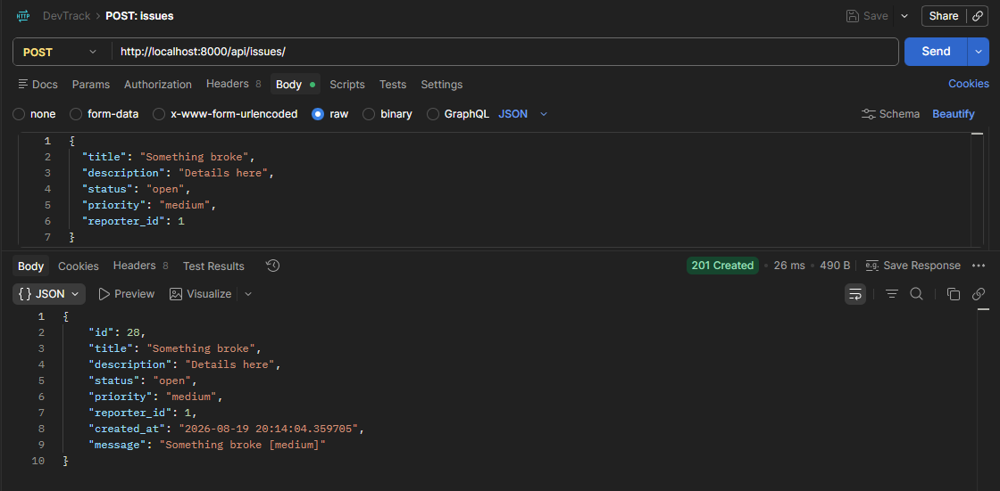
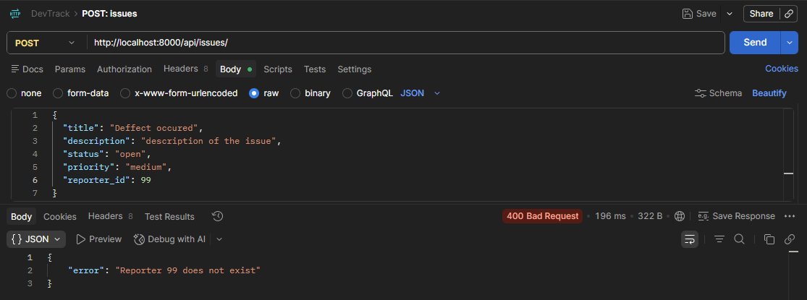
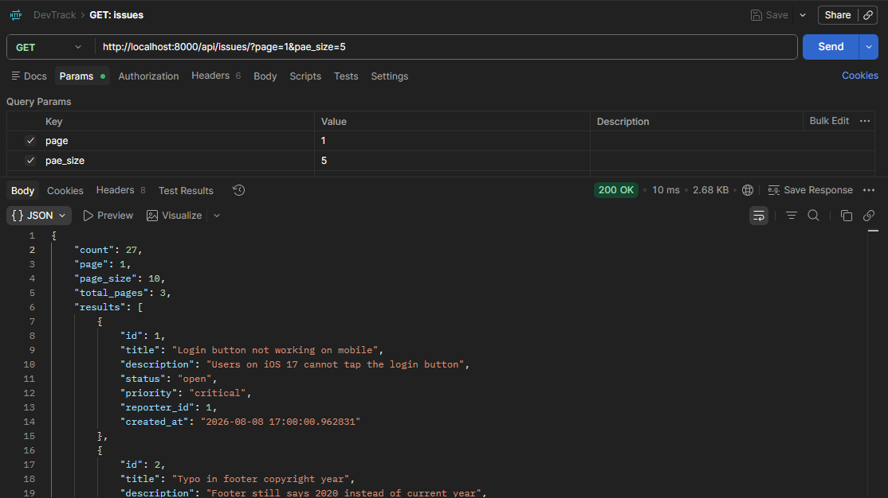
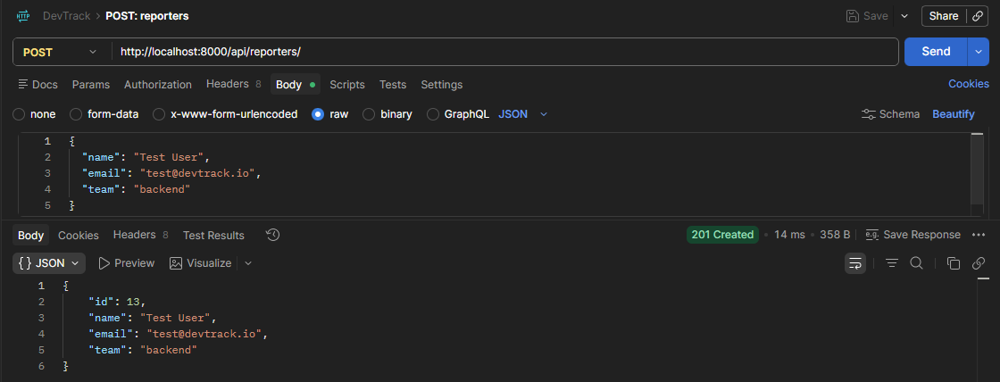
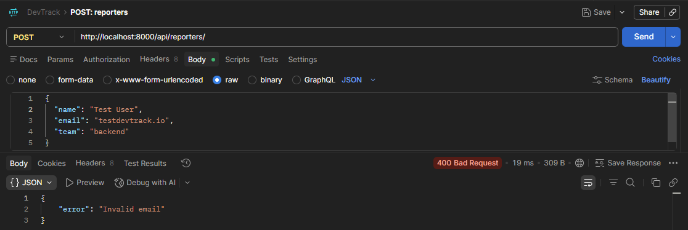
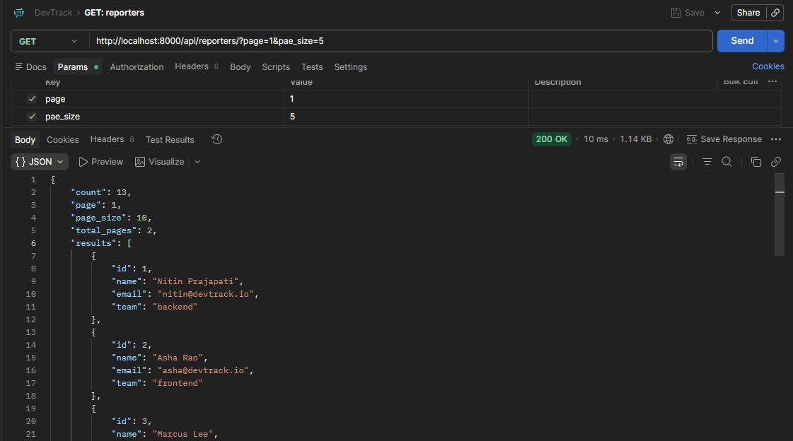

# DevTrack

A small Django API for tracking issues and their reporters. Built with plain Python OOP domain classes (not Django models/ORM) backed by flat JSON files, with pagination and validation on top.

## Requirements

- Python 3.11+

Dependencies (pinned in [requirements.txt](requirements.txt)):

```
asgiref==3.12.1
Django==5.2.17
sqlparse==0.5.5
tzdata==2026.3
```

## How to run

```bash
# from the project root
python -m venv .venv
.venv\Scripts\activate          # Windows
# source .venv/bin/activate     # macOS/Linux

pip install -r requirements.txt

python manage.py migrate
python manage.py runserver
```

The API is now available at `http://127.0.0.1:8000/`.

Data is persisted to flat JSON files under [data/](data/) (`issues.json`, `reporters.json`) rather than the SQLite database — `db.sqlite3` is only used for Django's built-in `admin`/`auth`/`sessions` apps, none of which this API relies on.

## Endpoints

All endpoints are namespaced under `/api/` (see [devtrack/urls.py](devtrack/urls.py) and [issues/urls.py](issues/urls.py)).

### `GET /api/reporters/`

Lists reporters, paginated.

- `?id=<id>` — return a single reporter by id (404 if not found), bypasses pagination.
- `?page=<n>` / `?page_size=<n>` — paginate results (defaults: `page=1`, `page_size=10`, capped at `100`).

### `POST /api/reporters/`

Creates a reporter.

```json
{
  "name": "Test User",
  "email": "test@devtrack.io",
  "team": "backend"
}
```

- `id` is optional — auto-assigned via `next_id()` if omitted.
- Validation (`Reporter.validate()` in [issues/models.py](issues/models.py)): `name` must be non-empty, `email` must contain `@`.
- Returns `201` with the created reporter, or `400` with an `error` message on missing fields or failed validation.

### `GET /api/issues/`

Lists issues, paginated.

- `?id=<id>` — return a single issue by id (404 if not found), bypasses pagination.
- `?status=<status>` — filter by status (`open`, `in_progress`, `resolved`, `closed`) before pagination is applied.
- `?page=<n>` / `?page_size=<n>` — same pagination rules as reporters.

### `POST /api/issues/`

Creates an issue.

```json
{
  "title": "Something broke",
  "description": "Details here",
  "status": "open",
  "priority": "medium",
  "reporter_id": 1
}
```

- `id` is optional — auto-assigned if omitted. `created_at` is set automatically.
- `priority` determines which class is instantiated (`CriticalIssue`, `LowPriorityIssue`, or the base `Issue`), each with its own `describe()` message returned in the response as `message`.
- Validation (`Issue.validate()`): `title` non-empty, `status` in the valid set, `priority` in the valid set.
- `reporter_id` must reference an existing reporter — the view checks it against `read_reporters()` and rejects the request with a `400` if no match is found.
- Returns `201` with the created issue, or `400` with an `error` message on missing/invalid fields.

### Pagination response shape

Both list endpoints return:

```json
{
  "count": 27,
  "page": 1,
  "page_size": 10,
  "total_pages": 3,
  "results": [ ... ]
}
```

`page` and `page_size` are clamped to sane bounds (`page` floors at 1 and is capped at the last valid page; `page_size` is clamped between 1 and 100) — see [issues/pagination.py](issues/pagination.py).

## Design decision

**Reporter-existence validation lives in the view, not in `Issue.validate()`.**

`Issue.validate()` (in [issues/models.py](issues/models.py)) only checks fields the `Issue` object owns by itself (`title`, `status`, `priority`) — it has no knowledge of storage or of other entities. Checking whether `reporter_id` refers to a real reporter requires reading `reporters.json`, which is a storage concern, not a domain-object concern. Keeping that lookup in `create_issue` (in [issues/views.py](issues/views.py)) — where `read_reporters()` is already imported — keeps the OOP model classes free of I/O and storage dependencies, while the view stays responsible for orchestrating storage reads/writes and translating failures into HTTP responses.

## Testing in Postman

Server run locally at `http://localhost:8000`.

**Create issue — success (`201`)**

`POST /api/issues/` with a valid `reporter_id`:



**Create issue — failure (`400`)**

`POST /api/issues/` with a `reporter_id` that doesn't exist:



**List issues — paginated (`200`)**

`GET /api/issues/?page=1&page_size=10`:



**Create reporter — success (`201`)**

`POST /api/reporters/`:



**Create reporter — failure (`400`)**

`POST /api/reporters/` with an invalid email (missing `@`):



**List reporters — paginated (`200`)**

`GET /api/reporters/?page=1&page_size=10`:


